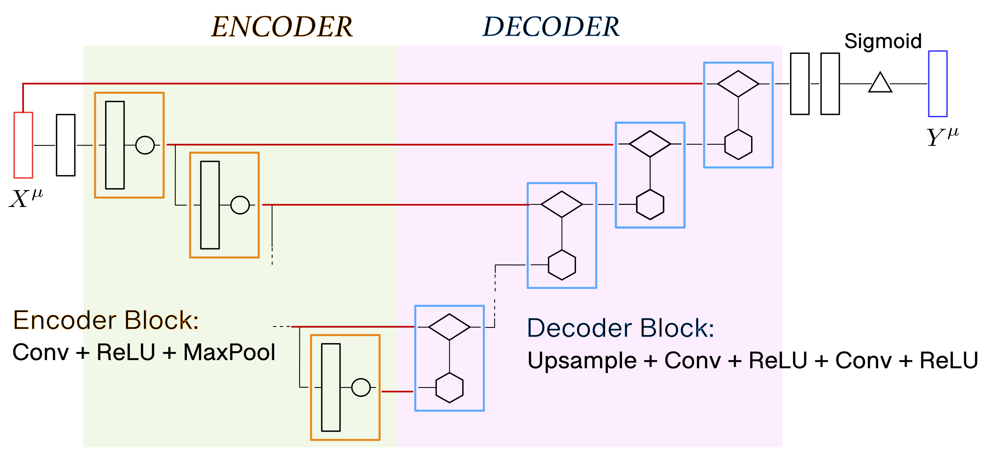
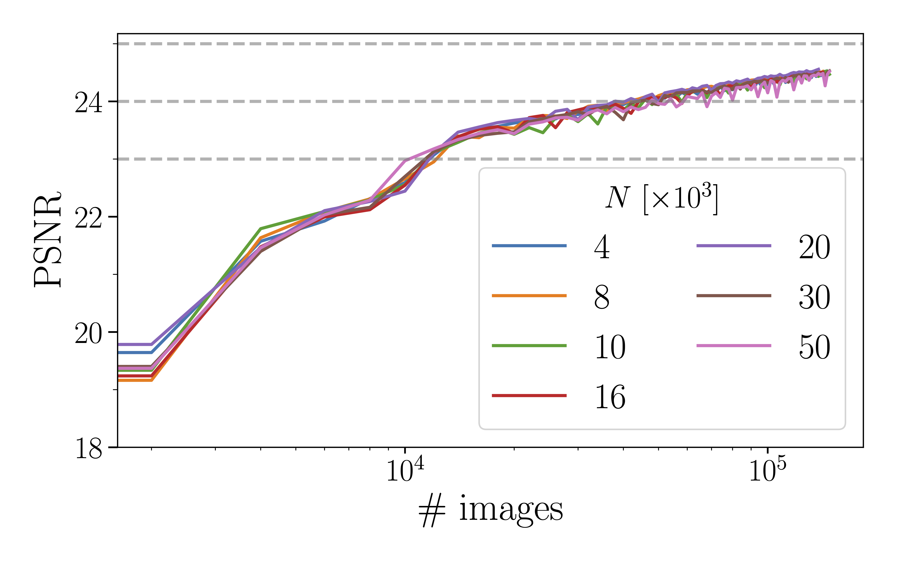
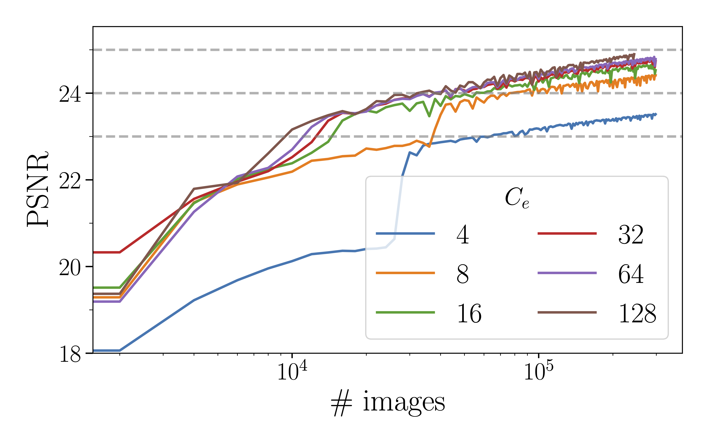
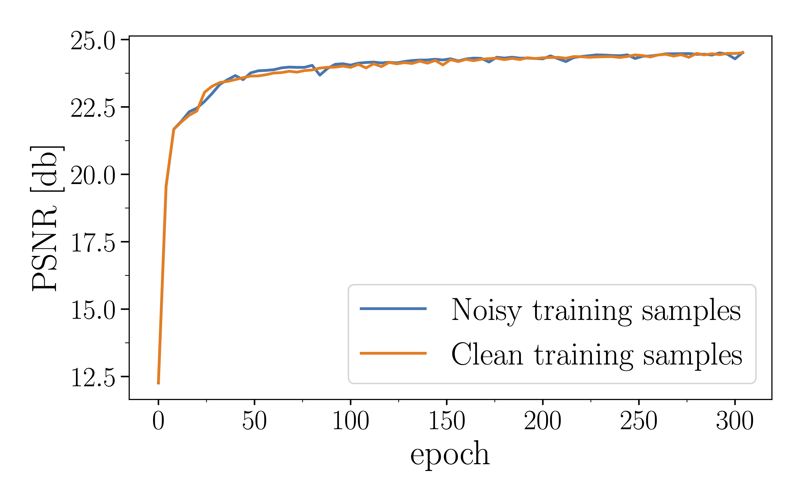
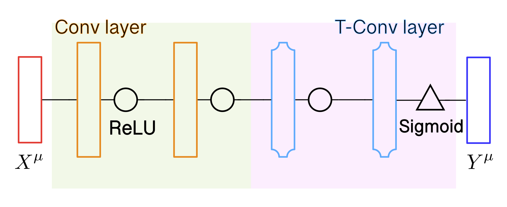
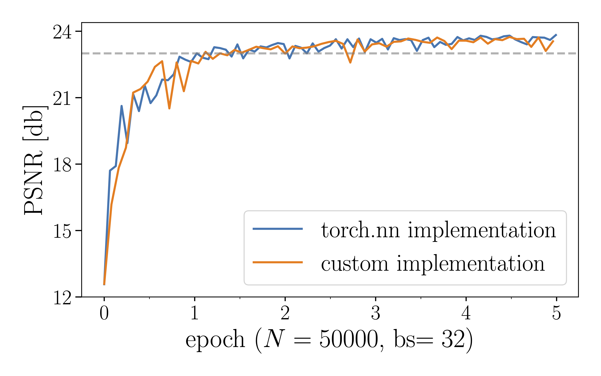

# Image restoration without clean data

**Authors:** Luca Gravina, Giorgio Palermo

Signal restoration and statistical modelling of signal corruptions have been long-lasting problems in statistical data analysis, to which, recently, deep neural networks have been successfully applied. Typically, a regression model, e.g., a convolutional neural network (CNN), is trained on a large data-set consisting of pairs $(X^\mu, Y_{\mathrm{clean}})$ of corrupted inputs $X^\mu$ and clean targets $Y_{\mathrm{clean}}$. By minimizing an appropriately chosen empirical risk function $\mathcal{L}$, a parametric family of mappings between a noisy input and the underlying ground truth to be inferred, is so found.

In this work we follow the observations put forward by Lehtinen et al., and remark that signal reconstruction, and training of a regression model, can be performed even on a data-set consisting exclusively of corrupted samples, with comparable - if not superior - results than those obtained using clean references.

<p align="center">
    
</p>

*Figure 1: Network architecture used in our report. We opted for `PReLU` nonlinearities rather than the more common `LeakyReLU` to increase the number of learnable parameters without having to increase the number of convolutional and pooling layers as well.*

## Network Description

The chosen autoencoder architecture performing signal restoration is displayed in Figure 1 and was designed to operate on input tensors with dimension $X \sim [N, C=3, H=32, W=32]$.

A first convolutional layer separates the input from the encoding structure (green shaded area), and serves the purpose of increasing the number of relevant features from $C=3$ to $C_e$. The encoding structure is composed of $N_e=4$ encoding blocks (orange rectangles), each one consisting of a convolution operation with kernel $f_e\sim[C_e, C_e, h=3, w=3]$, a Max-Pooling operation with kernel $f_{mp}\sim[2,2]$, separated by a ReLU nonlinearity with trainable parameters (`PReLU`). All convolution operations are accompanied by an appropriate padding, so as to keep the image's spatial dimensions unchanged, and avoid boundary-induced artifacts in the image reconstruction. The unavoidable compression of the latent space, however, is what constrains the number of possible encoding layers to $N_e$.

$N_e$ decoder blocks (blue rectangles) are used to create the decoding structure shown as a pink shaded area in Figure 1. Each block consists of an upsampling layer with scaling factor $s_{\mathrm{up}}=2$, a concatenation layer, and two convolutional layers with kernels $f_{d,1} \sim [C_{d,1}, C_{d,1}, h=3, w=3]$ and $f_{o,2} \sim [C_{d,2}, C_{d,3}, h=3, w=3]$ respectively. The latter alternate with as many trainable ReLU nonlinearities. The following code details the implementation of a generic decoding block. Note that not all blocks will share the same number of features, as this depends on the number of channels carried by the second input of the concatenation layer.

```python
class _Decoder_Block(nn.Module):
    def __init__(self, in0, in1, out1, kernel_size):
        super().__init__()
        self.conv0 = nn.Conv2d(in0, in1 , kernel_size, padding='same')
        self.conv1 = nn.Conv2d(in1, out1, kernel_size, padding='same')
        self.relu0 = nn.PReLU(in1)
        self.relu1 = nn.PReLU(out1)
        
    def forward(self, x, y):
        x = F.interpolate(x, scale_factor=2, mode='nearest') #upsample
        x = torch.cat((x,y),dim=1)    #concatenate
        x = self.relu0(self.conv0(x)) #first convolution 
        x = self.relu1(self.conv1(x)) #second convolution
        return x
```

Progressing through the forward pass of the network, the original input, and the output of all encoder blocks but the last, are stored in memory (red lines). The concatenation layers of the decoding blocks are progressively used to concatenate the latter to the advancing upsampled signal, taking care to match those tensors with analogous dimensions. Two convolutional layers are placed at the output of the decoding structure to restore the number of features to $C=3$; while a final Sigmoid function is employed to bound the output of the network between 0 and 1. The inner workings of the network are best understood by looking at its PyTorch implementation, which is displayed below:

```python
class Model(nn.Module):
    def __init__(self):
        super().__init__()
        ...
        #ENCODER
        self.conv0 = nn.Conv2d(ChIm, oute, kernel_size, padding='same')
        self.conv1 = nn.Conv2d(oute, oute, kernel_size, padding='same')
        eblock = _Encoder_Block(oute, oute, kernel_size, maxp_ksize=2)
        self.eblocks = nn.ModuleList([eblock]*Ne)
        
        #DECODER
        dblock0 = _Decoder_Block(in0=2*oute, in1=outd, out1=outd, kernel_size)
        dblock1 = _Decoder_Block(in0=outd+oute, in1=outd, out1=outd, kernel_size)
        dblock2 = _Decoder_Block(in0=outd+3, in1=outd//2, out1=outd//3, kernel_size)
        self.dblocks = nn.ModuleList([dblock0] + [dblock1]*(nb_elayers-2) + [dblock2])
        
        self.conv2 = nn.Conv2d(outd//3, 3, kernel_size=kers, padding='same')
        self.relu  = nn.PReLU()

    def predict(self, x):
        ...
        #ENCODER
        pout = [x]
        y = self.relu(self.conv0(x))
        for l in self.eblocks[:-1]:
            y = l(y)
            pout.append(y)
        y = self.eblocks[-1](y)
        y = self.relu(self.conv1(y))
        
        #DECODER
        for i,l in enumerate(self.dblocks):
            y = l(y, pout[-(i+1)])
        y = torch.sigmoid(self.conv2(y))
        return y
```

## Results

The figure of merit chosen to benchmark our network is the peak signal-to-noise ratio (PSNR) which is evaluated on a validation set composed of $N_{\mathrm{val}}=1000$ pairs of noisy images (to be denoised by the network) and their associated ground truths.

The model's parameters are trained by the stochastic gradient descent optimizer for which a vanishing weight decay has been chosen, as suggested when in the presence of `PReLU` nonlinearities. The input is decomposed in batches of size $\mathrm{bs}=16$ and the validation of the model is performed every $n_{\mathrm{bs}}=150$ batches. The MSE loss generated by the validation procedure is fed into PyTorch's `torch.optim.lr_scheduler.ReduceLROnPlateau()` scheduler so as to dynamically reduce the learning rate in response to changes in the PSNR and delay as much as possible its saturation. In order to make the input variables be as decorrelated as possible, we compute mean and standard deviation "per pixel and color channel" and normalize the data with respect to it. We observed that the benefit introduced by such pre-processing of the data is analogous to that provided by a "per image" normalization.

<div align="center">


</div>

*Figure 2: (left) PSNR evolution as a function of the number of processed images. The choice of using the number of images in the training set (instead of the more common number of epochs) as coordinate for the horizontal axis is motivated by the desire to compare the network's denoising capabilities when trained with datasets of different sizes.(right): Dependence of the PSNR's evolution on the number of features $C_e$ embedded within each encoding layer. In a regular scale, the above curves are analogous to those found by Lehtinen et al. apart from a lower PSNR which is most likely due to the reduced native image resolution (32×32 vs 256×256) and (consequently) shallower network.*

In Figure 2 we display the behaviour of the PSNR against the number of processed (possibly repeating, e.g, when epoch>1) images for different truncations of the training dataset. We observe that increasing the number of independent images beyond $\sim 4\times 10^3$ does not result in an increase in the PSNR: indeed, although more epochs are required when considering smaller datasets, identical precisions are reached upon processing a fixed, sufficiently large, number of images. For completeness, we performed data augmentation (rotations, color jittering and cropping) on the training dataset and evaluated the evolution of the PSNR over $N=150000$ independent samples. Curves identical to those presented above were found.

Noticeably, both the model's learning rate and its ultimate precision are influenced by the number of features $C_e$ embedded within each encoding block. In the native network we set $C_e=32$ as models with $\gtrsim 32$ features seem to perform almost identically.

<p align="center">
    
</p>

*Figure 4: Comparison of the PSNR's increase during training for clean and corrupted target references. As expected, no advantage is observed when training over clean references.*

We remark that values of $\mathrm{PSNR}\sim 25 \text{db}$ can be reached with the network in Figure 1. This is to be compared to the simpler network implemented below whose efficiency is limited to $\mathrm{PSNR}\sim 23 \text{db}$.

To conclude, we empirically verify our initial statement, that is, that a denoising network trained on a dataset composed exclusively of noisy samples is as performing as one trained over a dataset consisting of pairs of corrupted inputs, and clean targets. To do so, we split in half the validation set: the first half we use to train the model, the second for validation. The same model is then trained on 500 pairs of compromised images. Surely, in Figure 4 we are able to observe the equivalence in performance.

## Further Observations

On a quest to improve the network proposed in Figure 1 we considered networks containing batch normalization and dropout layers in different locations, and tested their effectiveness under different choices of parameters. No improvement was registered, we suppose, because of an insufficient depth of the network.

Although the weight's evolution rates across layers during training were not directly observed, we verified that no remarkable improvement is provided by a weight initialization different from PyTorch's native one.


# Image restoration from scratch

We have seen that signal restoration by machine learning can be performed even with a data-set consisting exclusively of corrupted samples; the only requirement being that each pair of samples in the data-set (training input and training target) explicates independent and identically distributed realizations of some noise model.

While the focus of the section above was the realization of a NN for reconstructing an image with the highest possible peak signal-to-noise ratio (PSNR) evaluated on a validation set composed of a noisy image (input) and its ground truth (target), here we focus on the custom implementation of each of the code blocks used to realize the above.

The simple sequential network shown in Figure 1, composed of two convolutional layers and two transposed convolution upsampling layers, is used to benchmark our implementation of the aforementioned functions. Rectified linear units (ReLU) are employed as nonlinearities between the inner layers, while a final Sigmoid function is employed, as in Report 1, to bound the output of the network within the interval [0,1].

<p align="center">
    
</p>

*Figure 1: Simple sequential NN for noise-to-noise signal reconstruction.*

## (Transposed) Convolution Layer

A set of $N$ digital images $\{X^{\mu}\}_{\mu\in\{1,\dots N\}}$ of height $H$ and width $W$ can be represented as a tensor $(X^{\mu})_{mn}^{\alpha}$ with the indices $m \in [0, H-1], n\in [0, W-1]$ indicating pixel coordinates, $\alpha \in \{\text{R},\text{G}, \text{B}\}$ the color channel, and $\mu$ the selected sample.

The convolution operation of this tensor with the four-dimensional kernel $f^{\alpha\beta}_{ij}$ of size $h\times w$, $D$ features and $C$ output channels, is defined as:

$$
(Y^{\beta})_{mn} = (X \circledast f)^{\beta}_{mn} = \sum_{\alpha} \sum_{i,j} f_{ij}^{\alpha\beta}\,(X^{\mu})_{m+i, n+j}^{\alpha}
$$

with: $i\in[0, h-1]$, $j \in [0,w-1]$, $\beta\in[0,D-1]$.

Given a loss function $\mathcal{L}$ evaluated on the output of a convolution layer $(Y^{\alpha})_{kl}$, its derivative with respect to the convolution's input $(X^{\mu})_{mn}^{\alpha}$ and weights $f_{ij}^{\alpha\beta}$ is found to be:

$$
\frac{\partial\mathcal{L}}{\partial(X^{\mu})_{mn}^{\alpha}} = \sum_\beta\sum_{k,l} \frac{\partial\mathcal{L}}{\partial(Y^{\beta})_{kl}}f_{m-k, n-l}^{\alpha \beta} = \left(\frac{\partial\mathcal{L}}{\partial Y} \ast f\right)^\alpha_{mn}
$$

$$
\frac{\partial\mathcal{L}}{\partial f_{ij}^{\alpha\beta}} = \sum_\mu\sum_{i,j} \frac{\partial\mathcal{L}}{\partial(Y^{\beta})_{ij}}\ (X^{\mu})_{m+i, n+j}^{\alpha} = \left(\frac{\partial\mathcal{L}}{\partial\tilde{Y}} \circledast \tilde{X}\right)_{ij}^\alpha
$$

Here $\tilde{Y}$ and $\tilde{X}$ identify a transposition operation along the sample and channel dimensions of the four-dimensional tensors $(Y^{\beta})_{ij}$ and $(X^{\mu})_{mn}^{\alpha}$. The operation defined in the first equation is known as a *transposed convolution* and can be written for a general input tensor $(X^{\mu})_{mn}^{\alpha}$ and kernel $f_{ij}^{\alpha\beta}$ as:

$$
(Y^{\beta})_{mn} = (X \ast f)^{\beta}_{mn} = \sum_{\alpha} \sum_{i,j} f_{ij}^{\alpha\beta}\,(X^{\mu})_{m-i, n-j}^{\alpha}
$$

Having shown that all derivatives relevant to a (transposed) convolutional layer can be cast as convolutions and transposed convolutions themselves, two main points remain to be examined, namely: an efficient implementation of a (transposed) convolutional layer with arbitrary stride, padding, kernel size and dilation, and the effect of a non-unit stride on the derivative equations.

The former consists in reducing the problem to a single matrix multiplication via PyTorch's `fold` and `unfold` methods. Consider the convolution $Y = X\circledast f$ with kernel $f\sim[D,C,h,h]$. Within each sample image $X\sim[1,C,H,H]$, we identify all those $h\times h$ patches which contribute to the convolution's output via the Frobenius inner product, convert them into column arrays, and stack them row-wise. The presence of several input channels is accounted for by column-stacking patches overlapping along the channel dimension. The resulting flattened image is $X\leadsto X'_\mu\sim[1, h^2\,C, L]$, with:

$$
L = \left\lfloor\frac{H - 2\cdot\text{padding} - \text{dilation} \cdot (\text{kernel\_size}-1) -1 }{\text{stride}} +1 \right\rfloor^2
$$

The presence of multiple samples is accounted for by concatenating the first and last dimension of $X'$. Finally, $(X')^\mu \sim [NL, h^2\,C]$. At the same time, the kernel tensor is flattened along the last three dimensions so that $f \leadsto f' \sim [D, h^2\,C]$. The convolution operation can now be written as a simple matrix multiplication: $Y'_\mu = (X')^\mu \cdot {(f')^T}$ with $(Y')^\mu\sim[NL, D]$. Lastly, the output vector can be reshaped into the four dimensional tensor $Y:[N,D, \sqrt{L}, \sqrt{L}]$. Similarly, any transposed convolution operation $Z = Y \ast f$ can be reduced to the matrix multiplication $Z' = (Y')^\mu \cdot f'$ where $Z'$ is the flattened representation of the output $Z$ whose reshaping operations are carried out in reversed order with respect to the previous case.

Finally, non-unit strides can be easily integrated into the backward propagation by simply dilating the matrix $\partial L/\partial Y$ by $s=\text{stride}-1$. With a non-unit stride, the possibility of not covering the input map entirely arises. In such cases, the derivatives with respect to some of the input values have to be manually set to vanish.

## Module Class

Each of the four different types of layers (Convolution, Transposed Convolution, Sigmoid and ReLU) share the same structure implementing the forward and backward pass.

The weights and biases of each module, should there be any, are stored as instance variables in `module.weight` and `module.bias`, respectively, and are updated by the stochastic gradient descent (SGD) algorithm. The latter requires the derivative of a user-defined loss function with respect to the layer's weights and biases, which are evaluated at each step and stored into `module.d_weight` and `module.d_bias`.

Two methods are common to all modules: `forward` and `forward_and_vjp`.

The `forward` method takes as input a tensor, to which it applies a different transformation depending on the type of layer (see below), and returns the transformed tensor.

The `forward_and_vjp` method takes the same arguments as the `forward` method and returns a tuple, the first element of which is identical to the output of the `forward` method alone. The second element of this tuple, on the other hand, consists of the function handle `_vjp(torch.Tensor)` which, given the derivative of the loss function with respect to the output of the module, computes the derivative of the loss with respect to the module's input, parameters and bias, namely $\partial \mathcal{L}/\partial X^{(\ell)}$ and $\partial \mathcal{L}/\partial f^{(\ell)}$ and $\partial \mathcal{L}/\partial b^{(\ell)}$, where $\ell$ identifies a specific layer.

As we have seen, although $\partial \mathcal{L}/\partial X^{(\ell)}$ can be computed through $\partial \mathcal{L}/\partial Y^{(\ell)}$ alone, computing $\partial \mathcal{L}/\partial f^{(\ell)}$ requires the knowledge of the input $X^{(\ell)}$ of each layer. Therefore, when moving though the forward pass, the latter would have to be stored in an additional layer-specific instance variable along with any other quantity necessary for the evaluation of the layer's backward pass. The advantage of returning the function `_vjp` rather than the layer's derivatives directly, is that all necessary quantities for its evaluation (which all possess a higher or equal scope than that of the function's definition) are automatically stored within the function handle. The implementation of the Sigmoid layer is shown below as a simple example of the aforementioned structure.

```python
class Sigmoid(Module):
    ...
    def forward(self,input):
        return torch.sigmoid(input)
    __call__ = forward

    def forward_and_vjp(self, input):
        def _vjp(dL_dy):
            dsigma_dx = torch.sigmoid(input)*(1.-torch.sigmoid(input))
            return (dL_dy*dsigma_dx , torch.Tensor([]), torch.Tensor([]))
        return self.forward(input), _vjp
```

## Container

The `Sequential` class implements the analogous of PyTorch's sequential container. Modules are added to it, and stored within the ordered dictionary `self._modules`, in the order they are passed in the constructor. The whole container is treated as a single module, and as such, it presents with both a `forward` and a `forward_and_vjp` method.

The `forward` method accepts as input a four-dimensional tensor which is passed directly to the first module of the container. The output of each module is taken as the input of the next one, finally returning the output of the last module (see below).

```python
def forward(self, input):
    for module in self._modules.values():
        input = module(input)
    return input
```

In much the same way, the `forward_and_vjp` method sequentially accesses each module in the container, evaluating both its output and the associated function handle `_vjp`. While the former is again used as input to the subsequent layer, the latter is stored within a list of functions which, upon reversed traversal, is able to produce all derivatives necessary for the backward pass. The following code snippet is explicative of the aforementioned process.

```python
def forward_and_vjp(self, input, vjp_loss):
    VJP = [None]*self.nb_modules
    for i,module in enumerate(self._modules.values()):
        input, VJP[i] = module.forward_and_vjp(input)

    dL_dy = vjp_loss(input)
    for i, (module, vjp) in enumerate(zip( reversed(self._modules.values()), reversed(VJP) )):
        dL_dy, module.d_weight, module.d_bias = vjp(dL_dy)
```

Noticeably, the derivative of the loss with respect to a layer's input $\partial \mathcal{L}/\partial X^{(\ell+1)}$, is used as the previous layer's derivative with respect to its output $\partial \mathcal{L}/\partial Y^{(\ell)}$, fundamental for the propagation of the backward pass. Initiating this process of concatenated function evaluations, is the evaluation of the loss' derivative with respect to the network's output. In our code we implemented the MSE loss, $\mathcal{L} \propto \sum_\mu \|X - Y\|_2$ so that $\partial \mathcal{L}/\partial Y^\mu \propto 2 (X -Y)$.

Both the output of the forward pass and of the backward pass of the convolutional layers were compared to the ones obtained from PyTorch's native implementation using the `torch.allclose` function. In particular, each of the derivatives were tested separately by comparing the output of `_vjp` to the elements of `torch.grad(F.mse_loss(y, F.conv2d(x,weight=f, bias=b)), [x,f,b])`.

## Network Results

To summarize our results we display in Figure 2 the PSNR for both the custom and `torch.nn` implementations of the NN. Upon sufficient training (>4 epochs), we find:
- $\text{PSNR}_{\text{custom}} = 23.55 \pm 0.18 \, \text{db}$
- $\text{PSNR}_{\text{torch.nn}} = 23.68 \pm 0.11 \, \text{db}$

<p align="center">
    
</p>

*Figure 2: PSNR ratio for both the custom and standard implementations of the NN displayed in Figure 1.*

## Implementation Features

### Custom Modules Implemented
- **Convolution Layer**: Custom implementation with arbitrary stride, padding, kernel size and dilation
- **Transposed Convolution Layer**: For upsampling operations
- **ReLU Activation**: Rectified linear unit nonlinearity
- **Sigmoid Activation**: For output bounding between [0,1]
- **Sequential Container**: For chaining modules together

### Key Technical Aspects
- **Matrix Multiplication Optimization**: Convolutions reduced to matrix multiplications using fold/unfold operations
- **Automatic Differentiation**: Custom implementation using Vector-Jacobian Products (VJP)
- **Gradient Validation**: All gradients validated against PyTorch's native implementation
- **Memory Efficient**: Function handles store necessary intermediate values automatically

## Requirements

- PyTorch
- NumPy
- Matplotlib (for plotting results)

## Usage

1. Clone the repository
2. Ensure all required dependencies are installed
3. Import the custom modules from the implementation
4. Create a network using the Sequential container and custom layers
5. Train the network on your noise-to-noise dataset
6. Compare performance with PyTorch's native implementation

## Validation

The implementation has been thoroughly validated by:
- Comparing forward pass outputs with PyTorch's native implementation using `torch.allclose`
- Validating gradients against `torch.grad` for each component separately
- Achieving comparable PSNR performance on the denoising task

---

## References

Lehtinen, J., et al. "Noise2Noise: Learning Image Restoration without Clean Data." *Proceedings of the 35th International Conference on Machine Learning*, 2018.
